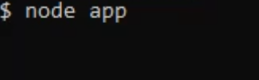
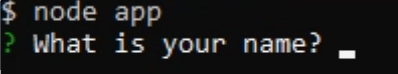

# portfolio-generator
  
## Description

As a developer I wanted a way of making the process of adding projects to my portfolio easier.
This project is built on the concept of automating the process of building a portfolio where you are able to add and update the projects that you have developed. 

## Table of Contents

- [Installation](#installation)
- [Usage](#usage)
- [Credits](#credits)
- [License](#license)

## Installation

This project runs on using the terminal and node. If you have yet to [install node](https://nodejs.org/en/) please do so before downloading this application.

## Usage

1. Open up a terminal in my case I am using bash.
2. Change the directory to the directory where you downloaded the file.
3. Type `node app` in the directory to run the program

4. The first question asks you for your name.

## Credits

[tonito98](https://github.com/tonito98)

## License
MIT License

Copyright (c) 2022 tonito98

Permission is hereby granted, free of charge, to any person obtaining a copy
of this software and associated documentation files (the "Software"), to deal
in the Software without restriction, including without limitation the rights
to use, copy, modify, merge, publish, distribute, sublicense, and/or sell
copies of the Software, and to permit persons to whom the Software is
furnished to do so, subject to the following conditions:

The above copyright notice and this permission notice shall be included in all
copies or substantial portions of the Software.

THE SOFTWARE IS PROVIDED "AS IS", WITHOUT WARRANTY OF ANY KIND, EXPRESS OR
IMPLIED, INCLUDING BUT NOT LIMITED TO THE WARRANTIES OF MERCHANTABILITY,
FITNESS FOR A PARTICULAR PURPOSE AND NONINFRINGEMENT. IN NO EVENT SHALL THE
AUTHORS OR COPYRIGHT HOLDERS BE LIABLE FOR ANY CLAIM, DAMAGES OR OTHER
LIABILITY, WHETHER IN AN ACTION OF CONTRACT, TORT OR OTHERWISE, ARISING FROM,
OUT OF OR IN CONNECTION WITH THE SOFTWARE OR THE USE OR OTHER DEALINGS IN THE
SOFTWARE.

## Badges

## Features
Ability to 
If your project has a lot of features, list them here.

## How to Contribute
For any contributers, we will adhere to the [Contributor Covenant](https://www.contributor-covenant.org/) covenant.
### Contributor Covenant Code of Conduct

#### Our Pledge

We as members, contributors, and leaders pledge to make participation in our
community a harassment-free experience for everyone, regardless of age, body
size, visible or invisible disability, ethnicity, sex characteristics, gender
identity and expression, level of experience, education, socio-economic status,
nationality, personal appearance, race, caste, color, religion, or sexual
identity and orientation.

We pledge to act and interact in ways that contribute to an open, welcoming,
diverse, inclusive, and healthy community.

#### Our Standards

Examples of behavior that contributes to a positive environment for our
community include:

* Demonstrating empathy and kindness toward other people
* Being respectful of differing opinions, viewpoints, and experiences
* Giving and gracefully accepting constructive feedback
* Accepting responsibility and apologizing to those affected by our mistakes,
  and learning from the experience
* Focusing on what is best not just for us as individuals, but for the overall
  community
